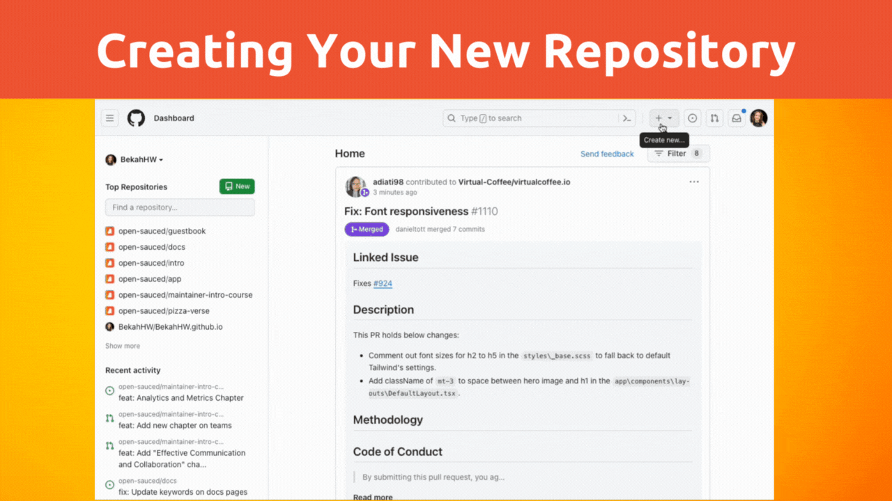
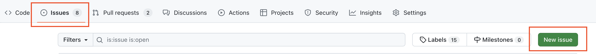
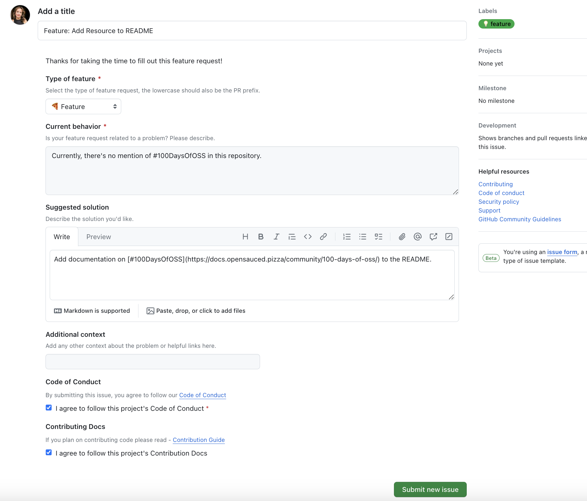

# Let's Get Practical: Starting Your Project

Now that you've gone through the course and understand what it takes to be a successful maintainer, let's get practical and start your first open source project as a maintainer!

## Prerequisites

You'll need to have the following:

- [Visual Studio Code (VS Code)](https://code.visualstudio.com/)
- A [GitHub Account](https://github.com)

## Choosing Your Project

Sometimes, the hardest part is deciding what you will work on. Here are some general ideas to get you started:

- Identify a problem or need in the open source community.
- Think about a topic you're passionate about that others might be interested in.
- Think about a problem you've had to solve that others can benefit from.

Don't think too hard about it now. You can always go back and update things later. For now, if you need a place to get started, let's create a repository about your favorite open source resources.

## Create Your Repository

We will walk through the steps to set up your project in GitHub. Although it's not the only way to get started with a project, it's the one we'll use in this demonstration.

- Go to [GitHub](https://github.com) and sign in.
- Click on the "+" icon in the upper right corner and select "New repository."
- Enter a repository name, description, and choose whether the repository should be public or private.
- Initialize the repository with a README file and add a license.
- Click "Create repository" button.



If you're using our starter idea, you could use the following:

    - Name: favorite-open-source-resources
    - Description: A markdown file of resources I've found to be most helpful.

## Adding Repository Documentation

Now that you have the repository, you can either edit it directly in GitHub or clone the project and work on it locally. We previously learned about how to create detailed READMEs, contributing guides, and codes of conduct in "[How to Setup Your Open Source Project](how-to-setup-your-project.md/how-to-setup-your-project.md)". If you need a reminder, take a look back at that chapter.

## Set Up Contributing Guidelines

Your project will likely have similar contribution guidelines to other projects. You can use the following steps to create your own guidelines, and we'll share the OpenSauced Contributing Guidelines below as an example. Feel free to use those guidelines and update them as you see fit for your project.

- Create a new file named `CONTRIBUTING.md` in the root of your repository.
- Outline the process for submitting issues and pull requests.
- Include coding standards, style guides, or any specific requirements.
- Mention how contributors can ask for help or clarification.
- If you need help getting started, check out the [OpenSauced Contributing Guidelines](https://docs.opensauced.pizza/contributing/introduction-to-contributing/).

## Set Up a Code of Conduct

It's essential to have a code of conduct to ensure that everyone feels welcome and safe in your project. Here's how to set up a code of conduct:

    - Create a new file named `CONTRIBUTING.md` in the root of your repository.
    - Copy and paste the code of conduct you'd like to use. We recommend using the [Contributor Covenant](https://www.contributor-covenant.org/).
         - Make sure you attribute the code of conduct to the original author.
    - Add a link to the code of conduct in your README and CONTRIBUTING files.

## Issue Forms, Pull Request Templates, and Labels

Creating good issues and using labels will help to create a strong project. Before creating your first issue, start by creating issue templates to make the process of submitting an issue clear to your contributors.

### Creating Issue Forms

In this section, we will create an issue template for a bug report. You can create templates for other types of issues as well, such as feature requests, questions, or documentation requests.

Below are the steps to create the template. After the steps, we'll share with you what we use at OpenSauced. Feel free to copy and paste that information into your repository and update it as needed.

- Create a new folder named `.github` in the root of your repository.
- Within that folder, create a new folder named `ISSUE_TEMPLATE`.
- In the `.github/ISSUE_TEMPLATE` directory, create a new file named `bug_report.yml`.
- Add a title and description to the template.
- Add a checklist of steps to reproduce the bug.
- Add a section for the expected behavior and actual behavior.
- Add a section for screenshots, if applicable.
- Add a section for additional context, if applicable.

Here's what we use at OpenSauced:

```yml
name: 🐛 Bug report
description: Create a bug report to help us improve Open Sauced 🍕
title: "Bug: "
labels: [👀 needs triage, 🐛 bug]
body:
  - type: markdown
    attributes:
      value: |
        Thanks for taking the time to fill out this bug report!
  - type: textarea
    attributes:
      label: Describe the bug
      description: A clear and concise description of what the bug is.
    validations:
      required: true
  - type: textarea
    attributes:
      label: Steps to reproduce
      description: Describe how to reproduce the behavior.
      placeholder: |
        1. Go to '...'
        2. Click on '...'
        3. Scroll down to '...'
        4. See error
    validations:
      required: true
  - type: dropdown
    attributes:
      multiple: true
      label: Browsers
      description: Select the browsers where the issue can be reproduced (that you know of).
      options:
        - "Chrome"
        - "Firefox"
        - "Safari"
        - "Edge"
        - "Opera"
        - "Other (add additional context)"
  - type: input
    id: context
    attributes:
      label: Additional context (Is this in dev or production?)
      description: Add any other context about the problem or helpful links here.
  - type: checkboxes
    id: terms
    attributes:
      label: Code of Conduct
      description: By submitting this issue, you agree to follow our [Code of Conduct](https://docs.opensauced.pizza/contributing/code-of-conduct/)
      options:
        - label: I agree to follow this project's Code of Conduct
          required: true
  - type: checkboxes
    id: contribution
    attributes:
      label: Contributing Docs
      description: If you plan on contributing code please read - [Contribution Guide](https://docs.opensauced.pizza/contributing/introduction-to-contributing/)
      options:
        - label: I agree to follow this project's Contribution Docs
          required: false
```

Now, let's follow the same process and make a feature request template.

- In the `.github/ISSUE_TEMPLATE` directory, create a new file named `feature_request.yml`.
- Add a title and description to the template.
- Add a checklist of steps to reproduce the bug.
- Add a section for the expected behavior and actual behavior.
- Add a section for screenshots, if applicable.
- Add a section for additional context, if applicable.

Here's what we use at OpenSauced:

```yml
name: 🚀 Feature request
description: Suggest an idea for this project 💡
title: "Feature: "
labels: [👀 needs triage, 💡 feature]
body:
  - type: markdown
    attributes:
      value: |
        Thanks for taking the time to fill out this feature request!
  - type: dropdown
    attributes:
      multiple: false
      label: Type of feature
      description: Select the type of feature request, the lowercase should also be the PR prefix.
      options:
        - "🍕 Feature"
        - "🐛 Fix"
        - "📝 Documentation"
        - "🎨 Style"
        - "🧑‍💻 Refactor"
        - "🔥 Performance"
        - "✅ Test"
        - "🤖 Build"
        - "🔁 CI"
        - "📦 Chore"
        - "⏩ Revert"
    validations:
      required: true
  - type: textarea
    attributes:
      label: Current behavior
      description: Is your feature request related to a problem? Please describe.
    validations:
      required: true
  - type: textarea
    attributes:
      label: Suggested solution
      description: Describe the solution you'd like.
  - type: input
    id: context
    attributes:
      label: Additional context
      description: Add any other context about the problem or helpful links here.
  - type: checkboxes
    id: terms
    attributes:
      label: Code of Conduct
      description: By submitting this issue, you agree to follow our [Code of Conduct](https://docs.opensauced.pizza/contributing/code-of-conduct/)
      options:
        - label: I agree to follow this project's Code of Conduct
          required: true
  - type: checkboxes
    id: contribution
    attributes:
      label: Contributing Docs
      description: If you plan on contributing code please read - [Contribution Guide](https://docs.opensauced.pizza/contributing/introduction-to-contributing/)
      options:
        - label: I agree to follow this project's Contribution Docs
          required: false
```

### Writing Your First Issue

- In your repository, click on the "Issues" tab and then the "New issue" button
  
- Select the type of issue you want to create. In this example, we'll select Feature Request.
- Write your issue. If you're following along the example, we'll write a feature request for a new resource:
  > **Type of feature:** 🍕 Feature
  > **Current behavior:** I'd like to see a new resource for #100DaysOfOSS.
  > **Suggested solution:** Add a new resource that introduces people to open source through [#100DaysOfOSS](https://docs.opensauced.pizza/community/100-days-of-oss/).
  > **Code of Conduct:** I agree to follow this project's Code of Conduct.
  > **Contributing Docs:** I agree to follow this project's Contribution Docs.
- Once you've completed the issues, click "Submit new issue."



## Promote Your Project

Now that you have your project set up, it's time to promote it! Here are some ideas to get you started: - Share your project on social media, forums, and relevant communities. - Write blog posts or tutorials about your project. - Present your project at meetups, conferences, or online webinars. - Create a Highlight on OpenSauced to showcase your project. - Share your project with friends, family, and colleagues. - Ask for feedback from your network.

## Recognize All Contributions

In order to maintain a healthy project where contributors feel valued, it's important to recognize contributions. Here are some ways to do that: - Use tools like the [All Contributors](https://allcontributors.org) bot to acknowledge different types of contributions. - Highlight contributors in your README or on your project's website. - Create a Highlight on OpenSauced to showcase contributors. - Thank contributors publicly for their work.

## Monitor

Once your project is up and running, monitoring its health and activity is important. Here are some ways to do that:

    - Use tools like [OpenSauced Repository Insights](https://docs.opensauced.pizza/features/insights/) to monitor the project's activity.
    - Set up notifications for new issues and pull requests.
    - Solicit feedback from users and contributors using discussions or surveys.
    - Reflect on the project's direction and make adjustments as necessary.

Congratulations on creating your first project! Remember, these steps are guidelines; the key to a healthy open source project is to foster an open, inclusive, and collaborative environment.
